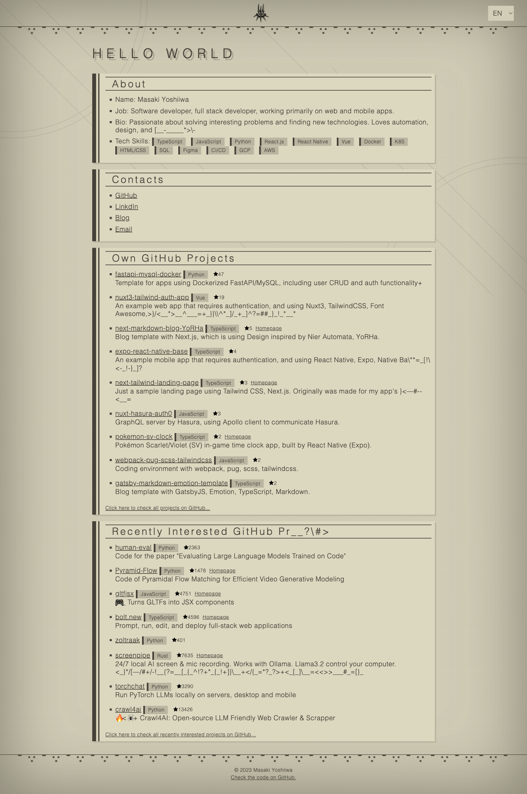

# [qlawmarq.github.io](https://qlawmarq.github.io/)



## Setup development environment

Make sure Node.js is installed on your machine.

```bash
npm i
npm run dev
```

## Deployment

Automated deployment to [GitHub Pages](https://pages.github.com/) by [GitHub Actions](https://github.com/features/actions).  
Using [SSG](https://kit.svelte.dev/docs/adapter-static) to building static files.  
See [static.yml](.github/workflows/static.yml) for more details.
